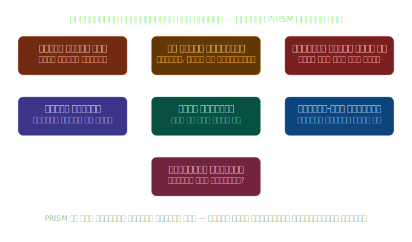
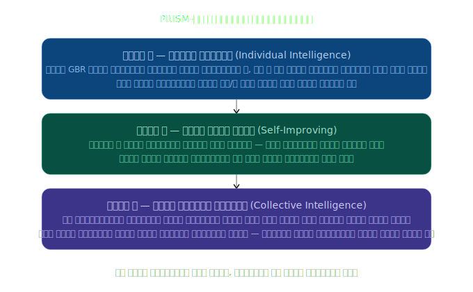
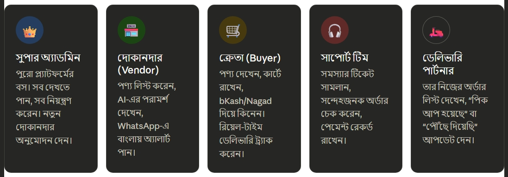
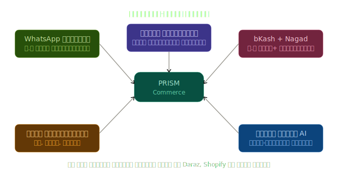
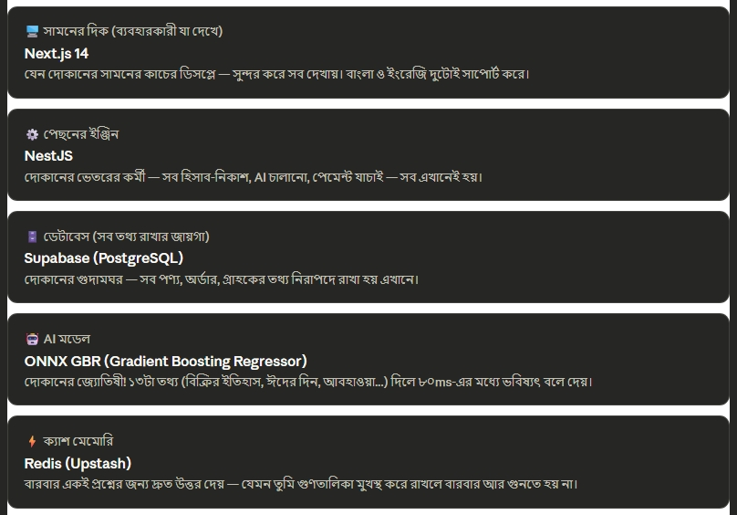

# PRISM Commerce: বাংলাদেশের দোকানদারদের জন্য AI-চালিত স্মার্ট সহকারী

## প্রথমে; এটা আসলে কী?

ধরো তোমার বড় আপু চকবাজারে কাপড়ের দোকান দিয়েছেন। ঈদের আগে তিনি প্রতিবার ভাবেন; "কতটুকু কাপড় কিনব? বেশি কিনলে পড়ে থাকবে, কম কিনলে বিক্রির সময় শেষ হয়ে যাবে।"

**PRISM Commerce হলো একটা স্মার্ট ওয়েবসাইট**; যেটা আপুর দোকানের জন্য একটা "ভবিষ্যৎ দেখার যন্ত্র" হিসেবে কাজ করে। এটা বলে দেয়; "আপু, আগামী ১৪ দিনে তোমার ৫০ পিস কাটপিস শেষ হয়ে যাবে, এখনই অর্ডার দাও!"

------

--- 

## AI কীভাবে কাজ করে?

PRISM-এর "মগজ" আছে তিনটা স্তরে। একটু ভাবো; তুমি যদি পরীক্ষায় বারবার ভুল করো, তুমি কি সেটা থেকে শিখবে না?

---

## কারা কারা এই সিস্টেম ব্যবহার করে?

PRISM-এ ৫ ধরনের মানুষ থাকে; প্রত্যেকের আলাদা কাজ।

---

## 🇧🇩 বাংলাদেশের জন্য বিশেষভাবে বানানো

এটা শুধু একটা কপি-পেস্ট প্ল্যাটফর্ম না; একদম বাংলাদেশের মাটির জন্য তৈরি।

---

## কী দিয়ে বানানো? (টেক স্ট্যাক)

এটা বুঝতে হলে ধরো; একটা বাড়ি বানাতে কী লাগে? ইট, সিমেন্ট, কাঠ, পাইপ। সফটওয়্যারেও সেরকম আলাদা আলাদা "উপাদান" ব্যবহার করা হয়।

    
---

## 📅 ৬ সপ্তাহের প্ল্যান

প্রজেক্টটা ৬ সপ্তাহে শেষ হবে। একটু একটু করে বানানো হবে।

    
---

## সহজ ভাষায় পুরো সারাংশ

এবার সব এক জায়গায় দেখো:

---

## একদম সহজ এক বাক্যে

**ধরো তোমার আপু চকবাজারে কাপড় বেচেন।** PRISM তাকে প্রতিদিন WhatsApp-এ বাংলায় বলে দেবে; "আপু, তোমার লাল শাড়ি ৯ দিনে শেষ হবে, এখনই ৫০ পিস অর্ডার দাও, ঈদের আগে দাম বাড়বে!"; আর আপু bKash দিয়ে সব পেমেন্টও করতে পারবেন, ডেলিভারি ট্র্যাক করতে পারবেন, সব বাংলায়, সব একজায়গায়, সম্পূর্ণ বিনামূল্যে।

এটাই হলো **PRISM Commerce**; বাংলাদেশের দোকানদারদের জন্য AI-চালিত "স্মার্ট সহকারী"।