# PRISM Commerce V4: বাংলাদেশের জন্য সম্পূর্ণ ব্যবসায়িক প্ল্যাটফর্ম

## এটা আসলে কী?; বড় ছবিটা আগে দেখো; 

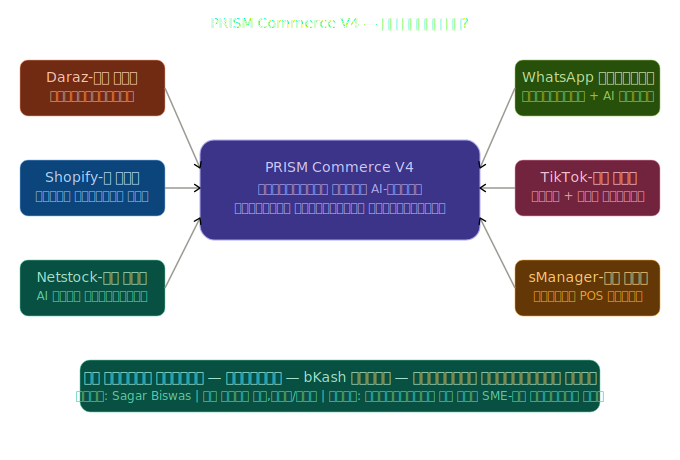

ভাবো Daraz + Shopify + Netstock + sManager + TikTok + WhatsApp; এই সবকিছু মিলিয়ে যদি একটা বাংলাদেশি প্ল্যাটফর্ম বানানো যায়, বাংলায়, bKash দিয়ে, ঈদের হিসাব বুঝে; সেটাই PRISM V4।

---

## সমস্যাটা কী?; ১২টা ব্যথা

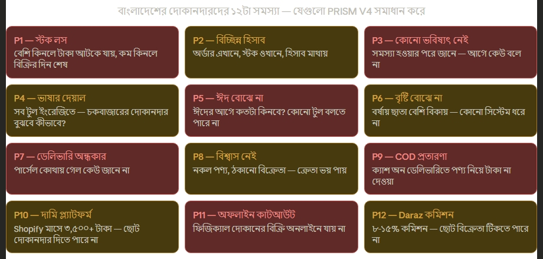

---

## টাকা কীভাবে আসবে?; ব্যবসার মডেল

এটা একটা প্ল্যানও বটে, আবার একটা ব্যবসাও বটে। V4-তে ৫টা প্ল্যান আছে দোকানদারদের জন্য:

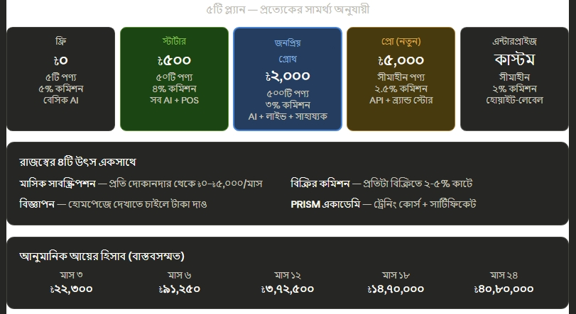

মনে রেখো; Shopify-র সবচেয়ে সস্তা প্ল্যান মাসে ৳৩,৫০০। PRISM স্টার্টার মাত্র ৳৫০০; ৭ গুণ সস্তা, আবার বাংলাদেশের জন্য আরো বেশি ফিচার!

---

## ৮ ধরনের মানুষ এই সিস্টেম ব্যবহার করবে

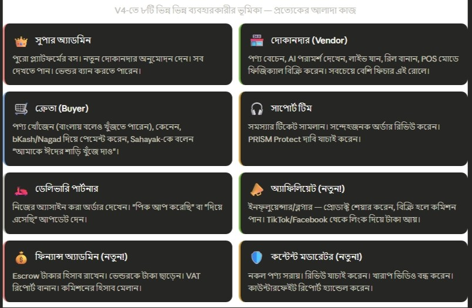

---

## AI-এর ১৫টি মডিউল; সিস্টেমের মগজ

এটাই PRISM-এর সবচেয়ে শক্তিশালী অংশ। ১৫টা আলাদা AI ইঞ্জিন একসাথে কাজ করে।

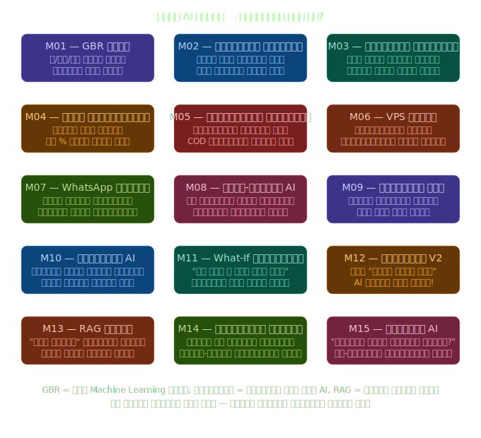

---

## V4-তে নতুন কী?; ১২টি স্ট্র্যাটেজিক মডিউল (A থেকে L)

এগুলো V4-তে একদম নতুন যোগ হয়েছে; এই জন্যই এটাকে "Production Platform" বলা হচ্ছে।

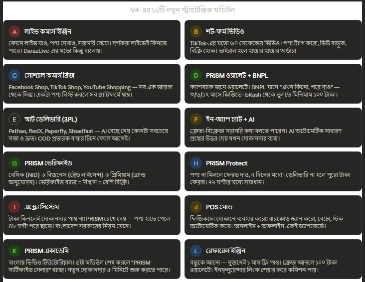

---

## সাহায্যক; PRISM-এর সবচেয়ে মজার অংশ!

এটা বুঝতে হবে একটু আলাদা করে। এটাই V4-এর সবচেয়ে বড় পরিবর্তন।

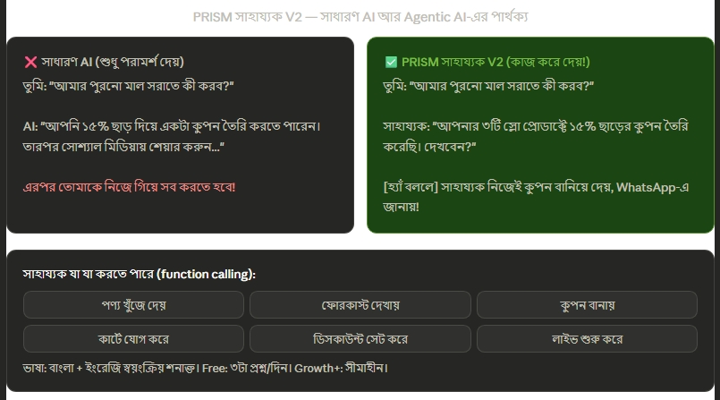

---

## বিশ্বাস ও নিরাপত্তার সিস্টেম; নতুন V4-এ

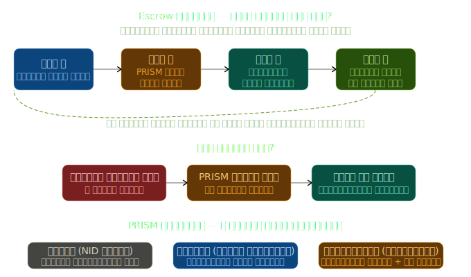

---

## 🇧🇩 বাংলাদেশের জন্য বিশেষ কী কী আছে?

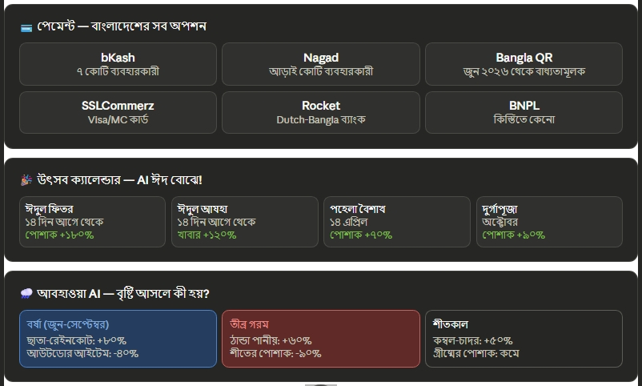

---

## সিস্টেম কীভাবে বানানো?; Architecture সহজ ভাষায়

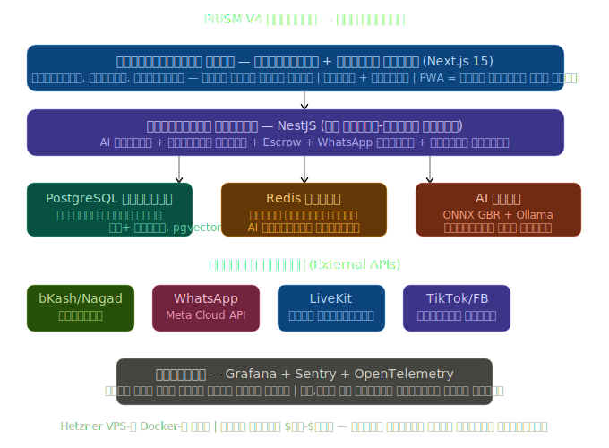

---

## 📅 ১৫ মাসের রোডম্যাপ; কীভাবে বানানো হবে?


---

## 👨‍💻 টিম কেমন হবে?

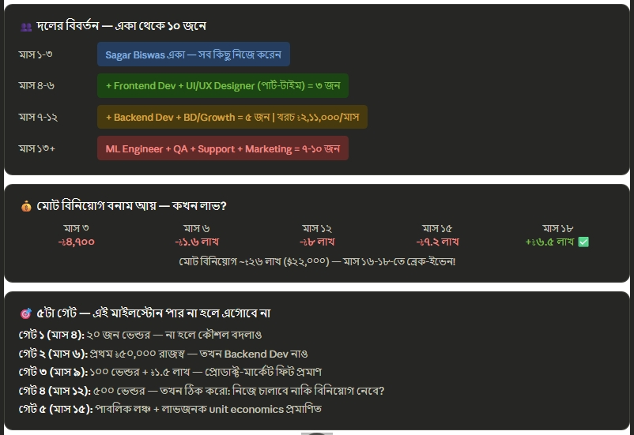

---

## 🧬 V3 বনাম V4; কী বদলেছে?

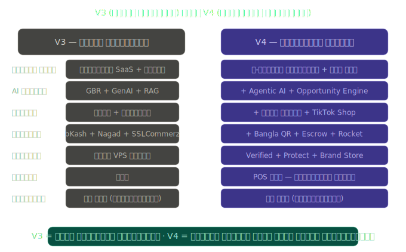

---

## 🎓 সহজ ভাষায় পুরো সারাংশ; একদম A to Z

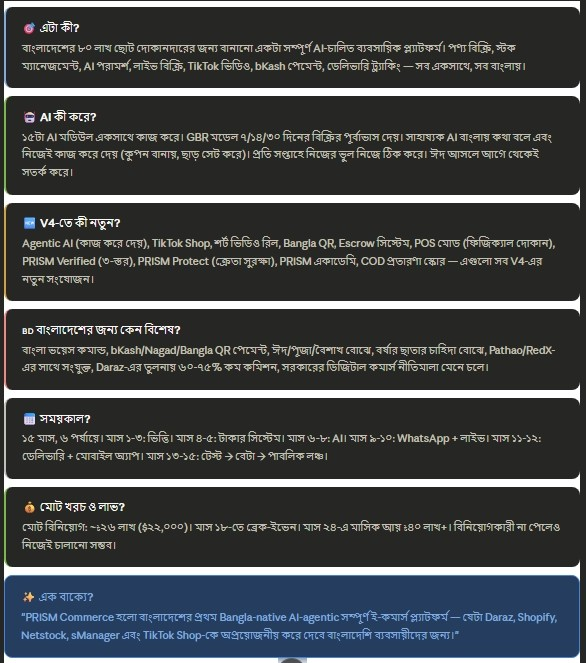

---

## 🎉 তুমি যা শিখলে আজকে:

**PRISM Commerce V4** হলো Sagar Biswas-এর বানানো একটা সম্পূর্ণ ব্যবসায়িক পরিকল্পনা; শুধু কোর্সের জন্য না, সত্যিকারের স্টার্টআপ শুরু করার জন্য।

## মোট কথা তিনটা:

**১)** বাংলাদেশের দোকানদারের সব সমস্যা একই জায়গায় সমাধান; Daraz-এর চেয়ে সস্তায়, বাংলায়, বাংলাদেশের পেমেন্টে।

**২)** AI শুধু পরামর্শ দেয় না, কাজও করে দেয়; "সাহায্যক"-কে বললেই কুপন তৈরি করে, ছাড় সেট করে।

**৩)** ১৫ মাস পরিশ্রম করলে নিজের টাকায় চালানো যাবে; বিনিয়োগকারী লাগবে না।

---